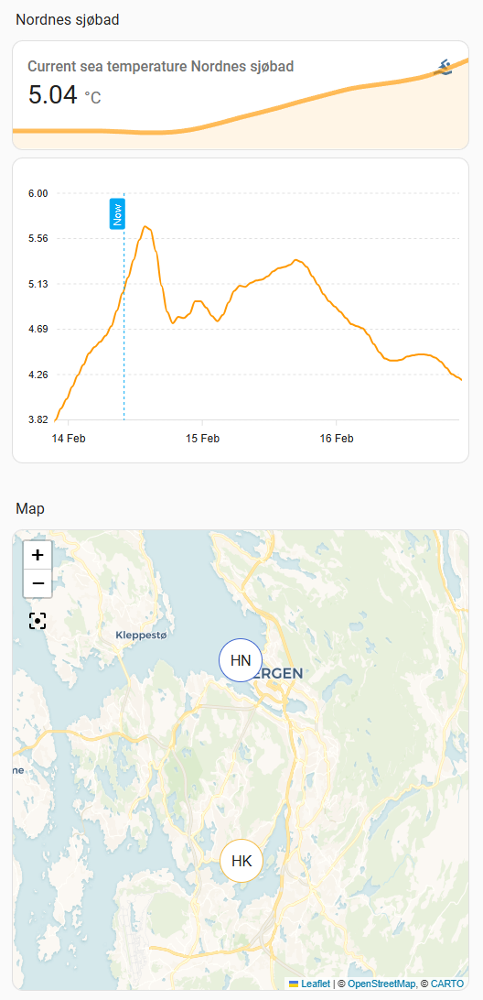

Navigate to: [My smart home](https://github.com/jm-cook/my-smart-home/tree/main)

[](https://github.com/jm-cook/ha-havvarsel-custom-integration)
[](https://github.com/jm-cook/ha-havvarsel-custom-integration/actions/workflows/validate.yaml)
[](https://github.com/jm-cook/ha-havvarsel-custom-integration/releases)


# HA Havvarsel Custom Integration
HA Havvarsel is a Home Assistant custom integration that provides oceanographic data from the Norwegian Institute for Marine Research (Havforskningsinstituttet).

This custom integration creates sensors for various oceanographic variables (temperature, salinity, currents, wave height, etc.) at specified locations along the Norwegian coast. It integrates directly with Home Assistant without requiring AppDaemon or MQTT.

## Installation

### Installation with HACS (Recommended)

1. Open HACS in your Home Assistant instance
2. Click on "Integrations"
3. Click the three dots in the top right corner
4. Select "Custom repositories"
5. Add the URL: `https://github.com/jm-cook/ha-havvarsel-custom-integration`
6. Select category: "Integration"
7. Click "Add"
8. Search for "Havvarsel" in HACS
9. Click "Download"
10. Restart Home Assistant

### Manual Installation

1. Copy the `custom_components/havvarsel` folder to your Home Assistant `custom_components` directory
2. Restart Home Assistant

## Configuration

After installation, add the integration through the Home Assistant UI:

1. Go to **Settings** → **Devices & Services**
2. Click **+ Add Integration**
3. Search for "Havvarsel"
4. Follow the configuration steps:
   - **Sensor Name**: A descriptive name for your location (e.g., "Home" or "Nordnes")
   - **Longitude**: The longitude of your desired location (e.g., 5.302337)
   - **Latitude**: The latitude of your desired location (e.g., 60.398942)
   - **Depth**: The depth in meters (default: 0 for surface)

The integration will automatically create 13 sensors for different oceanographic variables. By default, only the temperature sensor is enabled. You can enable additional sensors through **Settings** → **Devices & Services** → **Havvarsel** → (select your location) → **Entities**.

You can add multiple locations by repeating the process.

## Use

The sensors display current values and time series data for oceanographic variables at each location. Each sensor includes:

- **Current value**: The latest data point for the variable (e.g., temperature in °C)
- **Time series data**: Historical and forecast data stored in the `series` attribute
- **Metadata**: Variable information (units, standard names, etc.)
- **Location data**: Your coordinates and the nearest grid point used by the API

The sensors can be displayed on maps and in various cards.

## Available Variables

The integration creates sensors for the following oceanographic variables (disabled by default except temperature):

- **Sea water potential temperature** (°C)
- **Sea surface height above geoid** (m)
- **Salinity** (PSU)
- **Eastward sea water velocity** (m/s)
- **Northward sea water velocity** (m/s)
- **Sea water speed** (m/s)
- **Barotropic eastward sea water velocity** (m/s)
- **Barotropic northward sea water velocity** (m/s)
- **Wind from direction** (radians)
- **Wind speed** (m/s)
- **Sea surface wave significant height** (m)
- **Sea surface wave from direction** (radians)
- **Sea surface wave mean period** (s)

Enable the sensors you want through the entity settings in Home Assistant.

## Features

- 🌊 Current oceanographic data at specified locations along the Norwegian coast
- 📊 Time series data for all variables stored as attributes for charting
- 🗺️ Location information (your coordinates and nearest grid point)
- ♻️ Automatic updates every 10 minutes
- 🔄 Config flow UI for easy setup
- 📍 Support for multiple locations and depths
- 🎯 13 different oceanographic variables available
- 💡 Only fetches data for enabled sensors (efficient API usage)

### Example view configuration



The example view shown here is configured using the yaml code below. To plot time series 
data from the `series` attribute, the custom ApexCharts card must be installed (https://github.com/RomRider/apexcharts-card)

```yaml
views:
  - type: sections
    max_columns: 2
    title: Oceanographic data
    path: oceanographic-data
    sections:
      - type: grid
        cards:
          - type: heading
            heading: Home
            heading_style: title
          - graph: line
            type: sensor
            entity: sensor.havvarsel_home_sea_water_potential_temperature
            detail: 1
            icon: mdi:swim
            grid_options:
              columns: full
            name: Current sea temperature
          - type: custom:apexcharts-card
            grid_options:
              columns: full
              rows: 4
            graph_span: 72h
            span:
              offset: +60h
            now:
              show: true
              label: Now
            header:
              show: true
              show_states: true
            apex_config:
              stroke:
                curve: smooth
            yaxis:
              - id: temp
                decimals: 1
            series:
              - entity: sensor.havvarsel_home_sea_water_potential_temperature
                yaxis_id: temp
                name: Temperature
                data_generator: |
                  return entity.attributes.series.map((entry) => {
                    return [new Date(entry.timestamp).getTime(), entry.value];
                  });
              - entity: sensor.havvarsel_home_sea_water_potential_temperature
                yaxis_id: temp
                name: Trend (24h avg)
                group_by:
                  duration: 24h
                  func: avg
                data_generator: |
                  return entity.attributes.series.map((entry) => {
                    return [new Date(entry.timestamp).getTime(), entry.value];
                  });
      - type: grid
        cards:
          - type: heading
            heading: Map
            heading_style: title
          - type: map
            entities:
              - entity: sensor.havvarsel_home_sea_water_potential_temperature
            theme_mode: auto
            grid_options:
              columns: full
              rows: 8
```

## Removing Sensors

To remove a sensor, simply delete the integration from **Settings** → **Devices & Services** → **Havvarsel** → (select the device) → **Delete**.
